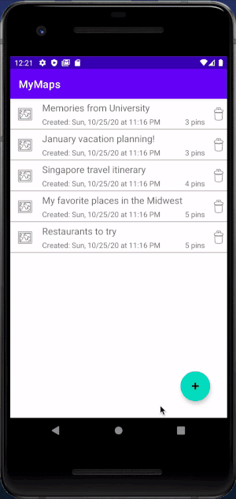

# My Maps 

## Dean Stratakos

**My Maps** displays a list of maps, each of which show user-defined markers with a title, description, and location. The user can also create a new map. 

Time spent: **5** hours spent in total

## Functionality 

The following **required** functionality is completed:

* [x] The list of map titles is displayed.
* [x] After tapping on a map title, the associated markers in the map are shown.
* [x] The user is able to create a new map.

The following **extensions** are implemented:

* [x] The user can delete a map.
* [x] There is a menu option in the map activity to change the ​map type​ (e.g. normal vs terrain).
* [x] When a new map marker is created, the pin has a falling animation.
* [x] For each map on the main screen, the user can also see the creation date and the number of pins on that map. There are also accompanying map icons to improve the aesthetics.

## Video Walkthrough

Here's a walkthrough of implemented user stories:

## Notes

I faced a few difficulties adding the date and time to the maps on the main screen. I switched between different formatters, which had to be used precisely in order for the app to run without crashing.

Given more time, I would like to implement more editing of the maps and pins once the user saves the map.

## License

    Copyright 2020 Dean Stratakos

    Licensed under the Apache License, Version 2.0 (the "License");
    you may not use this file except in compliance with the License.
    You may obtain a copy of the License at

        http://www.apache.org/licenses/LICENSE-2.0

    Unless required by applicable law or agreed to in writing, software
    distributed under the License is distributed on an "AS IS" BASIS,
    WITHOUT WARRANTIES OR CONDITIONS OF ANY KIND, either express or implied.
    See the License for the specific language governing permissions and
    limitations under the License.
